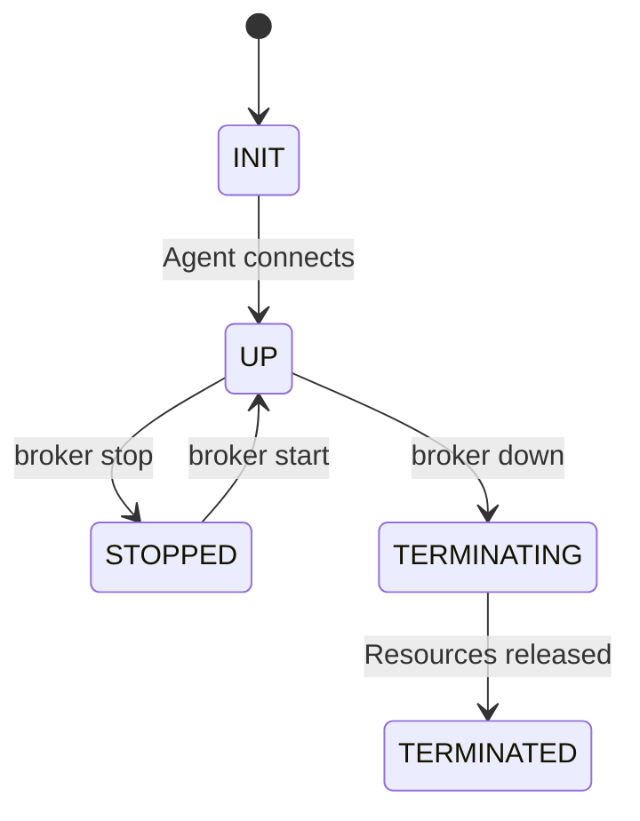

A cluster is a group of one or more nodes managed by broker. Each node runs a `broker-agent` instance that connects back to the server.

## Lifecycle



| Status | Description |
|---|---|
| `INIT` | Cluster created, nodes being provisioned |
| `UP` | At least one node is connected and healthy |
| `STOPPED` | Nodes exist but are stopped (not terminated) |
| `TERMINATING` | Teardown in progress, resources being released |
| `TERMINATED` | Cluster torn down, all resources released |

## Autostop

By default, clusters auto-terminate after 30 minutes of idle time. This prevents orphaned GPU instances from burning money.

```bash
# Custom autostop duration
broker launch -c my-cluster --autostop 1h task.yaml

# Disable autostop
broker launch -c my-cluster --autostop 0 task.yaml
```

## Creating a cluster

Clusters are created implicitly via `broker launch`:

```bash
broker launch -c my-cluster task.yaml
```

Or explicitly with just a name:

```bash
broker launch -c my-cluster
```

## Managing clusters

```bash
# List all clusters
broker status

# Stop (preserves resources, stops billing for compute)
broker stop my-cluster

# Restart a stopped cluster
broker start my-cluster

# Tear down (releases all resources)
broker down my-cluster
```

## Cluster naming

If you don't provide a name with `-c`, broker generates one:

```bash
broker launch task.yaml
# Cluster broker-a1b2c3d4 launched
```
