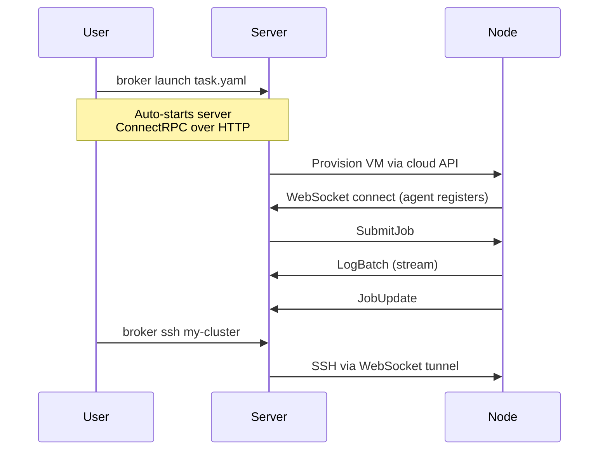

broker consists of three components:

| Component | Binary | Role |
|---|---|---|
| **CLI** | `broker` | User-facing command-line tool. Talks to the server via ConnectRPC. Auto-starts the server and installs SSH config on first use. |
| **Server** | `broker-server` | Control plane. Manages clusters, jobs, and agent connections. Single port serves the API, agent tunnel, and dashboard. Auto-started by the CLI for local development. |
| **Agent** | `broker-agent` | Runs on provisioned nodes. Executes jobs, streams logs, provides SSH access. Connects outbound to the server via WebSocket. |

## Requirements

- Go 1.22+ (for building from source)
- Docker (on nodes, for container-based workloads)
- Cloud credentials (for cloud provisioning -- AWS supported today)
