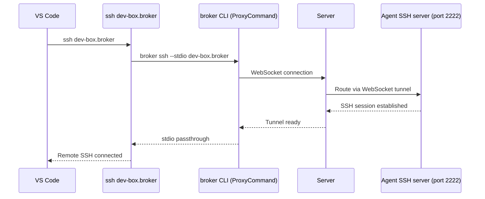

broker's built-in SSH server integrates with VS Code Remote SSH for a seamless development experience on remote GPU nodes.

## Setup

No manual setup required. The broker CLI auto-installs SSH config on first use, adding a `*.broker` wildcard to your SSH config.

If you need to reinstall manually:

```bash
broker ssh-config
```

This writes `~/.broker/ssh_config` with the following config and adds an `Include` directive to `~/.ssh/config`:

```
Host *.broker
    StrictHostKeyChecking no
    UserKnownHostsFile /dev/null
    LogLevel ERROR
    User root
    ProxyCommand broker ssh --stdio --hostname-suffix .broker %h
```

## Usage

1. Launch a cluster:

```bash
broker launch -c dev-box --gpus A100:1
```

2. Open VS Code and use the Remote SSH extension to connect to `dev-box.broker`.

3. VS Code connects through the broker CLI, which tunnels the SSH connection through the server to the agent's built-in SSH server.

You can also launch VS Code directly from the dashboard with one click.

## How it works



The agent's SSH server supports:

- PTY sessions with window resizing
- Non-PTY exec (used by VS Code for probing and file operations)
- Local port forwarding (access services running on the node)
- Reverse port forwarding

## Port forwarding

VS Code will automatically forward ports. You can also manually forward:

```bash
ssh -L 8888:localhost:8888 dev-box.broker
```

This forwards port 8888 on your local machine to port 8888 on the remote node, useful for Jupyter notebooks or TensorBoard.
